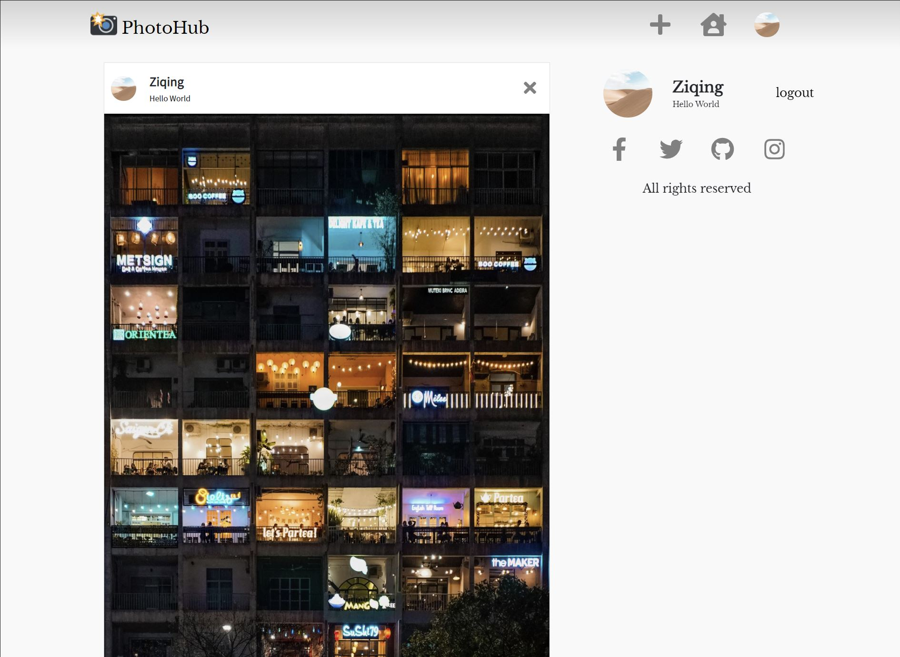
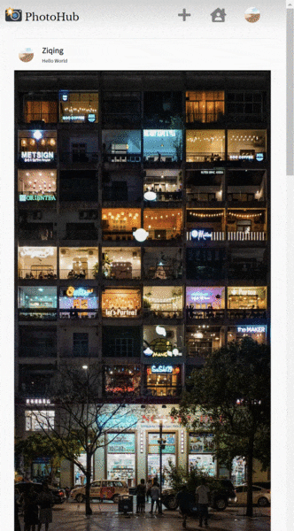
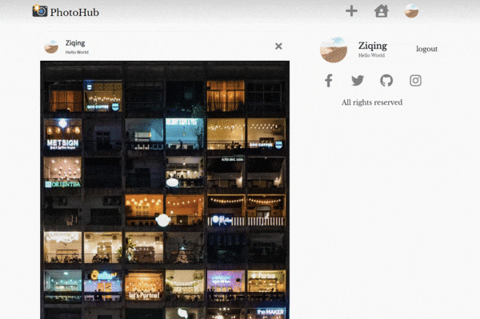
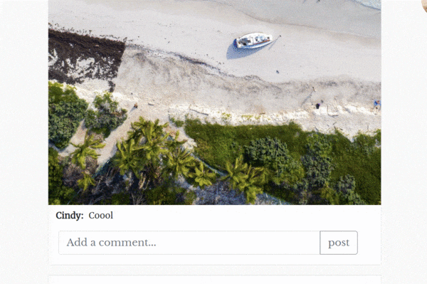
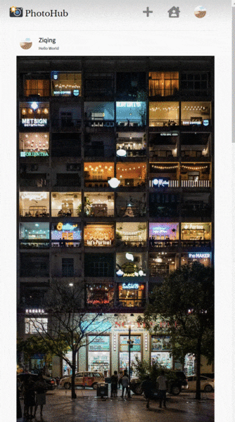

# PhotoHub

README.md is very impressive. Very detailed and emplains the components of the project.

## Project Objective
Photohub is a platform that users can view, share and comment on their photos.

We are going to use Express to develop the server, and implement AJAX communication to dynamically load the webpage.

</img>

## Author
Qiqi Chen: chen.qiq(at)northeastern.edu

Ziqing Mao: mao.zi(at)northeastern.edu

## Links
Class link: [CS5610 Web Development](https://johnguerra.co/classes/webDevelopment_spring_2021/)

Demo Link: https://photohub-qiqi-ziqing.herokuapp.com/

Video Demo: https://www.youtube.com/watch?v=2IA0SV-mcng

Slides: [Google Slides](https://docs.google.com/presentation/d/1ddZ0ozGYQksVEhBMuhe8gTP4zwWEDLGWNaVA2jgLqRE/edit#slide=id.gc6f80d1ff_0_50)

## Usage
### To visit the demo online:
````
https://photohub-qiqi-ziqing.herokuapp.com/
````

### To run it locally:
- Ensure that you have installed locally: 
  - Node.js 
  - MongoDB
- Set environment variable, or it would automatically connect to your default local mongo database
  - key: MONGO_URL
  - value: ${your_own_mongodb_url}
- clone the repo 
- run the following in the terminal
  ````
  npm install
  npm start
  ````
- visit `localhost:3000` in the browser

## Features
- The timeline would display images that users uploaded reverse-chronologically.
- By mouse scrolling, the timeline would load infinitely

  </img>
  
- Users could upload an image, or delete it.

  </img>
  
  </img>
  
- Users could post a comment, or delete it.

  </img>
  
- Users could filter the timeline to display their own posts only.

  </img>
  
- There would a gallery in users’ homepage.

  </img>
  
## Copyright
- This project is under [MIT license](./LICENSE). 
- Sample images of the demo are provided by [Unsplash](https://unsplash.com/) and their license page is [here](https://unsplash.com/license).
  - We appreciate the artworks of avinash-kumar, carlos-mesa, clayton-cardinalli, hakan-nural, jake-heidecker, kristina-manchenko, pablo-heimplatz, rahul-pandit, ruslan-bardash, stephen-walker, tengyart, tomas-malik, willian-justen-de-vasconcellos.
